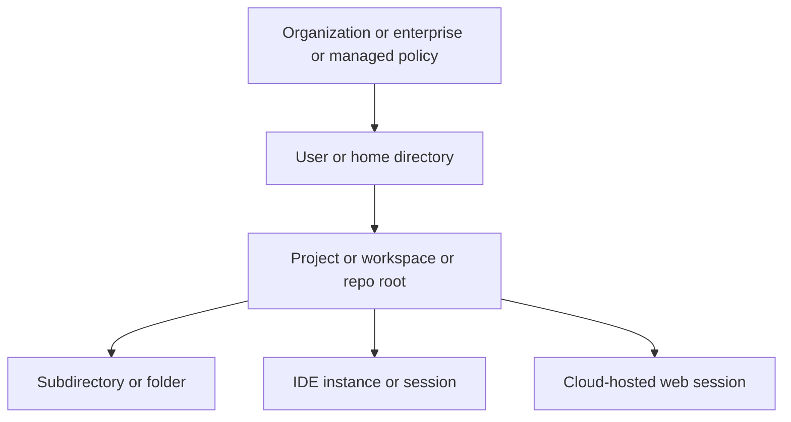

# Extension Points Across GitHub Copilot, OpenAI Codex, Amazon Kiro, and Claude Code

## Executive summary

Across the four tools, there is a clear common core: all four document a persistent instruction layer, all four expose external-tool integration through MCP, and all four now have some notion of reusable workflows or specialist behaviors rather than only one-shot prompting.[^gh1][^oa1][^ki1][^cc1] The biggest product differences are in **where customization lives** and **how shareable it is**. GitHub Copilot is strongest on repo, org, and enterprise sharing on GitHub surfaces; OpenAI Codex is strongest on nested filesystem scoping and policy-enforced local clients; Kiro is strongest on workspace-centric IDE automation and bundled “powers”; Claude Code has the broadest explicit extension taxonomy in a single `.claude` ecosystem, spanning instructions, rules, skills, commands, subagents, hooks, MCP, plugins, and output styles.[^gh1][^gh4][^oa2][^oa6][^ki6][^cc1][^cc8][^cc9] citeturn9view1turn9view2turn9view3turn17view2turn21view0turn32view4turn39view1turn39view7turn42search0

If you normalize vendor terms into a common taxonomy, the cleanest comparison is this: **persistent instructions**, **reusable workflows**, **tool adapters**, **specialist agents**, **deterministic automation**, **distribution/bundling**, and **policy/configuration**. GitHub uses “custom instructions,” “prompt files,” “custom agents,” “skills,” and “CLI plugins”; Codex uses `AGENTS.md`, skills, hooks, plugins, and MCP; Kiro uses steering, skills, custom agents/subagents, hooks, MCP, and powers; Claude Code uses `CLAUDE.md`, rules, skills, commands, subagents, hooks, MCP, plugins, and output styles.[^gh1][^gh7][^oa1][^oa3][^oa6][^ki1][^ki5][^ki6][^cc1][^cc5][^cc8][^cc9] citeturn9view2turn9view5turn16view0turn17view4turn21view0turn32view0turn32view6turn32view4turn39view1turn39view2turn39view7turn42search0

For a practical cheat sheet, the most important scoping distinction is whether an extension can live at **user/home**, **project/repo root**, **subdirectory/folder**, **organization/enterprise**, or **cloud/web session** scope. GitHub Copilot and Claude Code have the richest documented org-to-project hierarchy; Codex has the richest nested directory walk; Kiro has the richest workspace and multi-root behavior. Kiro is also the only one here with a first-class documented concept of **powers** as a context-throttling bundle that combines steering, MCP, and optional hooks.[^gh4][^oa1][^oa2][^ki1][^ki3][^ki6][^cc2][^cc3] citeturn9view3turn18view0turn17view2turn32view0turn32view5turn32view4turn41view0turn40view4

## Normalized taxonomy and method

I normalized each product’s terminology into a shared comparison frame:

| Normalized family | What it means in this report | Typical vendor terms |
|---|---|---|
| Persistent instructions | Always-on or auto-loaded guidance that shapes behavior | custom instructions, steering, `AGENTS.md`, `CLAUDE.md`, rules |
| Reusable workflows | Reusable prompt/workflow packages invoked explicitly or implicitly | prompt files, skills, commands |
| Tool adapters | External tools/data made available to the agent | MCP servers, plugin-bundled MCP, LSP servers |
| Specialist agents | Named agents or subagents with distinct prompts/tools | custom agents, subagents |
| Deterministic automation | Event-driven execution outside normal LLM discretion | hooks |
| Distribution and bundling | Shareable install artifacts or marketplaces | plugins, powers |
| Policy and configuration | Non-content configuration and centrally managed controls | `settings.json`, `config.toml`, `requirements.toml`, managed settings |

This normalization is a synthesis across the official docs, not a vendor-native taxonomy.[^gh1][^oa1][^ki1][^cc1] **Claim labels** mean: **explicit** when the docs say it directly, **strongly implied** when the docs show the behavior in tables/file layouts/surface docs, and **inferred** when the status classification required interpretation, usually because the docs did not explicitly say “GA.” citeturn9view2turn16view0turn32view0turn39view0

Not every tool supports every layer. GitHub Copilot and Claude Code clearly document org or managed-policy layers; Codex documents admin-enforced requirements and cloud-fetched requirements for Business and Enterprise; Kiro documents user and workspace most clearly, plus machine-level extension registry governance and team steering via distribution into `~/.kiro/steering`.[^gh4][^oa2][^oa8][^ki1][^ki7][^cc2][^cc3] citeturn9view3turn17view3turn23search0turn28view0turn27view10turn41view0turn40view4

## Cross-tool comparison

| Tool | Documented extension families | Strongest documented scopes | Documented interfaces | Availability notes |
|---|---|---|---|---|
| GitHub Copilot[^gh1][^gh2][^gh3][^gh4][^gh5][^gh6][^gh7] | custom instructions, prompt files, MCP, custom agents, skills, hooks, CLI plugins and LSP | personal account, repo root, subdirectory, organization, enterprise | GitHub.com, VS Code, Visual Studio, JetBrains, Eclipse, Xcode, CLI | prompt files are public preview; GitHub MCP Registry is public preview; several other features are documented without a preview banner |
| OpenAI Codex[^oa1][^oa2][^oa3][^oa4][^oa5][^oa6][^oa7][^oa8] | `AGENTS.md`, config and requirements, hooks, MCP, skills, plugins, subagents | user/home, repo root, nested subdirectory, admin/system, cloud-managed workspace | CLI, IDE extension, app, web; some extension support is only explicit on some surfaces | hooks are experimental; subagents are enabled by default in current releases; web launched as research preview |
| Amazon Kiro[^ki1][^ki2][^ki3][^ki4][^ki5][^ki6][^ki7] | steering, hooks, MCP, skills, custom agents, subagents, powers, IDE extensions and registry | user/home, workspace root, multi-root workspace, team-distributed home config, machine registry config | IDE, CLI, kiro.dev discovery surfaces | most features are documented as current; docs do not usually label them GA or preview |
| Claude Code[^cc1][^cc2][^cc3][^cc4][^cc5][^cc6][^cc7][^cc8][^cc9][^cc10] | `CLAUDE.md`, rules, settings, MCP, skills, commands, subagents, hooks, plugins, output styles | managed policy, user/home, project root, ancestor directories, subdirectories, project-private local files, cloud web sessions | terminal CLI, VS Code and Cursor, Desktop, web; docs also describe one shared engine across major surfaces | web is research preview; VS Code was announced in beta; most file-based extension mechanisms are documented as current |

The matrix above is a synthesis from the official product docs below. Where a surface is listed without an explicit “works here for every extension” statement, I call that out in the tool-specific sections as **strongly implied** or **inferred** rather than explicit. citeturn9view1turn12search0turn8view2turn16view0turn17view8turn32view0turn35view0turn39view1turn39view9turn39view10

## GitHub Copilot

### Custom instructions

**Normalized type:** persistent instructions. GitHub documents several distinct instruction layers: **personal instructions** on GitHub.com, **repository-wide** instructions via `.github/copilot-instructions.md`, **path-specific** instructions via `.github/instructions/**/*.instructions.md`, **organization instructions** on GitHub.com, and **agent instructions** such as `AGENTS.md` for some agentic surfaces.[^gh1] **Scope:** local user/account, repo root, subdirectory/folder, and organization; enterprise scope is not documented for generic instructions, though enterprise sharing exists for custom agents rather than instructions. **Interfaces:** GitHub.com, VS Code, Visual Studio, JetBrains, Eclipse, Xcode, and Copilot CLI vary by instruction type, with GitHub’s support matrix explicitly showing surface differences. **Availability:** unspecified in cited docs, which suggests current production availability but does not explicitly label GA. **Trust and execution model:** these are always-on context additions, not hard policy guards. **Claim strength:** explicit for the scope and surface matrix, inferred for the GA-like status.[^gh1] citeturn11view0turn9view2turn9view0

### Prompt files

**Normalized type:** reusable workflows. GitHub prompt files are reusable Markdown prompt templates stored at `.github/prompts/*.prompt.md`, invoked from chat as slash-style prompts such as `/explain-code`.[^gh2] **Scope:** repo root only; user, org, enterprise, and subdirectory scopes are unspecified. **Interfaces:** VS Code, Visual Studio, and JetBrains only. **Availability:** public preview, explicitly. **Trust and execution model:** prompt files are manual, reusable prompt templates with variables, not always-on instructions. **Claim strength:** explicit.[^gh2] citeturn12search0turn12search1turn12search5

### MCP servers

**Normalized type:** tool adapters. GitHub’s MCP support centers on the GitHub MCP server and the GitHub MCP Registry. The GitHub MCP server can run **remotely** in VS Code without local setup or **locally** in MCP-compatible editors; the GitHub MCP Registry is a curated list of partner and community MCP servers.[^gh3] **Scope:** local machine, IDE instance, and in VS Code also a GitHub-hosted remote server option; org and enterprise admins can gate access through policy. **Interfaces:** VS Code, Visual Studio, JetBrains, Eclipse, and Xcode are explicitly documented for the GitHub MCP server. **Availability:** the server is available to all GitHub users regardless of plan type, but the **registry** is in public preview; some tool access inherits paid-plan requirements. **Trust and execution model:** MCP exposes GitHub tools and API capabilities subject to OAuth/PAT auth, toolset selection, and organizational policy; GitHub also documents push-protection coverage for certain repos/features. **Claim strength:** explicit.[^gh3] citeturn8view0turn8view1turn8view2

### Custom agents

**Normalized type:** specialist agents. GitHub has two related custom-agent stories. For **Copilot cloud agent**, agent profiles can live in a repo’s `.github/agents/` directory and can also be centralized at organization or enterprise level in a `.github-private` repository, making them available across many repos.[^gh4] For **Copilot CLI**, agent definitions are `.agent.md` files stored either in `.github/agents/` for the project or `~/.copilot/agents/` for the user, with user scope taking precedence on name conflicts.[^gh4] **Scope:** user/home, repo root, organization, enterprise, and therefore effectively multiple repositories. **Interfaces:** GitHub.com cloud agent, Copilot CLI, and other agentic IDE surfaces; GitHub explicitly says custom agents are in public preview for JetBrains, Eclipse, and Xcode. **Availability:** public preview is explicit for those IDEs; status elsewhere is unspecified. **Trust and execution model:** custom agents provide specialized instructions, context, and tool restrictions, often by spinning up subagents. **Claim strength:** explicit, except any broader GA reading.[^gh4] citeturn9view3turn9view4turn8view4

### Skills

**Normalized type:** reusable workflows. GitHub describes **agent skills** as folders of instructions, scripts, and resources from an open standard. They can live in project paths such as `.github/skills/<skill-name>/SKILL.md` or equivalent `.claude/skills` or `.agents/skills` directories, and in personal locations such as `~/.copilot/skills/...`.[^gh5] **Scope:** project/repo, user/home, and by implication multiple repos through user scope. **Interfaces:** Copilot cloud agent, Copilot CLI, and agent mode in VS Code are explicitly called out. **Availability:** unspecified in cited docs. **Trust and execution model:** skills are loaded when relevant to specialized tasks rather than continuously; they can include scripts and resources. **Claim strength:** explicit.[^gh5] citeturn8view3turn9view2

### Hooks

**Normalized type:** deterministic automation. GitHub hooks are JSON-defined shell-command automations stored in `.github/hooks/*.json` for Copilot agents; for Copilot cloud agent they must be on the default branch, while Copilot CLI loads hooks from the current working directory.[^gh6] **Scope:** repo root for cloud agent, current working directory for CLI, with hook triggers spanning session start/end, prompt submission, and tool execution. **Interfaces:** Copilot cloud agent on GitHub and Copilot CLI in the terminal. **Availability:** unspecified in cited docs. **Trust and execution model:** hooks are deterministic lifecycle interceptors that can log, validate, or even approve/deny tool executions. **Claim strength:** explicit.[^gh6] citeturn9view7turn9view6

### CLI plugins and LSP servers

**Normalized type:** distribution and bundling. GitHub Copilot CLI plugins are installable units that can bundle **custom agents, skills, hooks, MCP server configurations, and LSP server configurations**; GitHub says they can be installed from a marketplace, a repository, or a local path.[^gh7] **Scope:** team or multi-project reuse is the central design point, but exact installation-state scopes are not fully documented in the excerpted material. **Interfaces:** Copilot CLI only, explicitly. **Availability:** unspecified in cited docs. **Trust and execution model:** plugins are a packaging layer for reuse and team standardization rather than a new runtime model by themselves. **Claim strength:** explicit for components and installation sources; scope beyond “reusable across projects” is strongly implied.[^gh7] citeturn9view5

## OpenAI Codex

### AGENTS.md instructions

**Normalized type:** persistent instructions. Codex reads `AGENTS.md` files before doing work and builds an instruction chain from **global scope** in `~/.codex` (or `CODEX_HOME`) plus **project scope** by walking from the project root, typically the Git root, down to the current working directory.[^oa1] It supports `AGENTS.override.md`, nested directory overrides, fallback filenames, and load-order precedence where more specific directories append later. **Scope:** user/home, repo root, subdirectory/folder, and effectively multiple repos via the home-directory layer. **Interfaces:** CLI is explicit; because the IDE extension uses shared configuration layers, IDE support is strongly implied, but the AGENTS page itself is written from the local-client point of view rather than a full surface matrix. Web/cloud support for AGENTS is not explicit in the cited docs. **Availability:** unspecified in cited docs. **Trust and execution model:** prompt-time guidance loaded at run start; more specific files override by concatenation order rather than hard policy. **Claim strength:** explicit for local scopes, strongly implied for CLI-plus-IDE reuse, unspecified for web.[^oa1] citeturn17view0turn18view0turn18view4turn17view2

### Configuration and requirements

**Normalized type:** policy and configuration. Codex stores user configuration in `~/.codex/config.toml` and supports project-scoped overrides in `.codex/config.toml`, including subfolder scoping within a repo; project config is loaded only for **trusted projects**.[^oa2] Codex also supports `requirements.toml`, an **admin-enforced** file for security-sensitive settings users cannot override, and for Business and Enterprise it can additionally fetch cloud-managed requirements across surfaces.[^oa2][^oa8] **Scope:** user/home, repo root, subdirectory/folder, admin/system, and cloud-hosted workspace policy. **Interfaces:** CLI and IDE extension share the same config layers explicitly; managed requirements are stated to apply across CLI, app, and IDE extension. **Availability:** current in docs; no preview label for config, but some feature-specific flags under config are feature-gated. **Trust and execution model:** this is the strongest formal control layer in Codex, governing approvals, sandbox modes, web-search modes, and feature flags. **Claim strength:** explicit.[^oa2][^oa8] citeturn17view2turn16view6turn17view3turn23search0

### Hooks

**Normalized type:** deterministic automation. Codex hooks are lifecycle scripts loaded from `hooks.json` files “next to active config layers,” with the most useful locations being `~/.codex/hooks.json` and `<repo>/.codex/hooks.json`.[^oa3] Matching hooks from multiple files all run, and several hook types run at turn scope. **Scope:** user/home and repo/project; subdirectory layering is implied if there are additional config layers, but the docs emphasize the home and repo locations. **Interfaces:** the hooks docs are written generically for Codex, but because they live beside shared config and the IDE extension uses the CLI/shared config, IDE support is strongly implied rather than fully explicit; web support is not documented in the cited hooks page. **Availability:** experimental, explicitly, and Windows support is temporarily disabled. **Trust and execution model:** deterministic scripts in the agent loop, not merely prompt instructions. **Claim strength:** explicit for locations and experimental status, strongly implied for shared local-client reuse.[^oa3][^oa8] citeturn16view7turn17view4turn16view10

### MCP servers

**Normalized type:** tool adapters. Codex supports MCP servers in both the **CLI** and the **IDE extension**, with STDIO and streamable HTTP transport, bearer-token auth, and OAuth where supported.[^oa4] MCP configuration lives in `config.toml`, usually `~/.codex/config.toml`, and can also be scoped per project with `.codex/config.toml` for trusted projects; the CLI and IDE extension share the same MCP configuration.[^oa4] **Scope:** user/home and project/repo; subdirectory scope is possible through nested project config files. **Interfaces:** CLI and IDE extension explicit; app and web support are not explicit in the cited MCP docs. **Availability:** unspecified in cited docs. **Trust and execution model:** external tools and data sources are made available as MCP tools with auth and transport-specific controls. **Claim strength:** explicit.[^oa4] citeturn17view8turn16view2

### Skills

**Normalized type:** reusable workflows. Codex skills are open-standard skill folders with `SKILL.md`, optional scripts, references, assets, and optional `agents/openai.yaml` metadata.[^oa5] Codex documents repository skills under `.agents/skills` from the current working directory up to the repo root, user skills under `~/.agents/skills`, admin skills under `/etc/codex/skills`, and system-bundled skills.[^oa5] **Scope:** subdirectory/folder, repo root, user/home, machine/admin, and system. **Interfaces:** CLI, IDE extension, and Codex app are explicitly supported. **Availability:** unspecified in cited docs. **Trust and execution model:** progressive disclosure; Codex initially loads metadata and loads full instructions only when a skill is selected explicitly or inferred implicitly. **Claim strength:** explicit.[^oa5] citeturn19view1turn16view3

### Plugins

**Normalized type:** distribution and bundling. Codex plugins bundle skills, app integrations, and MCP servers into reusable workflows, with docs explicitly stating that plugins are the **installable distribution unit** while skills are the **authoring format**.[^oa6] Codex supports curated plugin discovery in the **app** and **CLI**, and documents both repo and personal marketplaces at `$REPO_ROOT/.agents/plugins/marketplace.json` and `~/.agents/plugins/marketplace.json`.[^oa6] **Scope:** repo/team catalog, personal catalog, cross-project distribution, and community distribution via marketplaces. **Interfaces:** app and CLI are explicit; IDE support for plugin browsing/install is not explicit in the cited docs. **Availability:** unspecified in cited docs, though the plugins page notes that more plugin capabilities are coming soon. **Trust and execution model:** plugin use inherits approval settings, may require separate app authentication, and may bundle MCP setup or third-party app terms. **Claim strength:** explicit.[^oa6] citeturn21view0turn21view1

### Subagents

**Normalized type:** specialist agents. Codex subagents are built-in parallel delegated workflows rather than primarily file-authored extensions in the cited docs. Current releases enable subagent workflows by default, and visibility is surfaced in the **Codex app** and **CLI**, with IDE visibility “coming soon.”[^oa7] **Scope:** session/task scope rather than file or repo scope in the material captured here; custom subagent configuration is mentioned elsewhere in Codex docs, but the clearest explicit support in the cited sources is the runtime behavior. **Interfaces:** app and CLI explicit; IDE partial/coming soon. **Availability:** enabled by default in current releases. **Trust and execution model:** Codex only spawns subagents when explicitly asked; each subagent has its own context and tool work, increasing token use but isolating context. **Claim strength:** explicit.[^oa7] citeturn17view5turn16view8

## Amazon Kiro

### Steering

**Normalized type:** persistent instructions. Kiro’s steering files are Markdown-based persistent context. In both IDE and CLI docs, Kiro documents **workspace** steering in `.kiro/steering/` and **global** steering in `~/.kiro/steering/`; it also explicitly describes **team steering** as centralized files distributed into users’ home directories by MDM or Group Policy.[^ki1] Steering supports inclusion modes such as **always**, **fileMatch**, and **manual**, and manual steering files can be added to a conversation with `#name` or surfaced as slash commands in IDE chat.[^ki1] Kiro also documents support for `AGENTS.md` as an always-included steering source.[^ki1] **Scope:** user/home, workspace/project root, subdirectory/file-pattern targeting, and team-distributed global scope. **Interfaces:** IDE and CLI explicit. **Availability:** unspecified in current docs. **Trust and execution model:** contextual guidance, not a hard policy layer. **Claim strength:** explicit.[^ki1] citeturn32view0turn32view1turn28view2turn32view2turn28view3turn33search5

### Hooks

**Normalized type:** deterministic automation. In the **IDE**, Kiro hooks are agent automations triggered by IDE events or tool events, and can either **Ask Kiro** with an agent prompt or **Run Command** as a shell command.[^ki2] In practice, hook files live under `.kiro/hooks`, including in multi-root workspaces where Kiro collects hooks from each root folder and limits file-event hooks to the root that defines them.[^ki2] In the **CLI**, hooks are defined inside the custom agent configuration file as commands tied to events like `agentSpawn`, `userPromptSubmit`, `preToolUse`, `postToolUse`, and `stop`.[^ki2] **Scope:** IDE hooks are workspace/root scoped; CLI hooks inherit the scope of the agent definition, which can be workspace, global, or custom-path. **Interfaces:** IDE and CLI explicit. **Availability:** unspecified in current docs. **Trust and execution model:** deterministic automation, not just LLM guidance. **Claim strength:** explicit.[^ki2] citeturn27view2turn29search8turn31view0turn32view10

### MCP servers

**Normalized type:** tool adapters. Kiro’s IDE docs define MCP at two levels: workspace `.kiro/settings/mcp.json` and user `~/.kiro/settings/mcp.json`, merged with workspace precedence.[^ki3] In multi-root workspaces, Kiro retrieves MCP definitions from each root’s `.kiro` folder and initializes all of them at startup.[^ki3] Kiro’s CLI custom-agent schema also supports an embedded `mcpServers` field with commands, args, env, timeouts, and HTTP/OAuth configuration.[^ki3] **Scope:** user/home, workspace/root, multi-root workspace, and CLI-agent-local scope. **Interfaces:** IDE explicit, CLI explicit through agent configuration. **Availability:** unspecified in current docs. **Trust and execution model:** external-tool integration with command- or HTTP-backed MCP servers; the IDE also exposes server prompt/resource templates via the `#` mention system. **Claim strength:** explicit.[^ki3] citeturn27view3turn32view5turn31view0turn32view11

### Skills

**Normalized type:** reusable workflows. Kiro supports the open Agent Skills standard in both IDE and CLI. In the IDE, skills live at `.kiro/skills/` for workspace scope and `~/.kiro/skills/` for global scope, auto-activate when relevant, and can also be invoked directly as slash commands.[^ki4] In the CLI, skills use the same workspace/global locations, with workspace taking priority over global on conflicts; the default agent loads both automatically, while custom agents must explicitly list skill resources.[^ki4] **Scope:** workspace/project and user/home, with effective multi-repo coverage through the home directory. **Interfaces:** IDE and CLI explicit. **Availability:** unspecified in current docs. **Trust and execution model:** progressive disclosure rather than always-on injection. **Claim strength:** explicit.[^ki4] citeturn36view0turn36view3turn32view12turn27view5

### Custom agents and subagents

**Normalized type:** specialist agents. In the CLI, Kiro custom agents are JSON configuration files that define prompt, allowed tools, resources, hooks, MCP servers, model, and more. They can be created in `.kiro/agents/` for the workspace, `~/.kiro/agents/` globally, or a custom path, with workspace/local agents overriding global ones for matching names.[^ki5] The prompt field supports inline text or `file://` references, and resources can include files, skills, and indexed knowledge bases.[^ki5] In the IDE, Kiro subagents are documented separately: built-in subagents exist, and custom subagents can be created as Markdown files in `<workspace>/.kiro/agents` or `~/.kiro/agents`, then invoked automatically, by prompt, or as slash commands.[^ki5] **Scope:** workspace/project, user/home, custom path, and session/runtime subagent scope. **Interfaces:** CLI custom agents explicit; IDE custom subagents explicit. **Availability:** current docs; the IDE custom-subagent release is documented in Kiro’s February 2026 release materials. **Trust and execution model:** specialist agents can constrain tools and permissions, but Kiro explicitly warns that enabling write tools gives the agent access to modify files under `~/.kiro`, including skills, steering, MCP config, and other agent configs. **Claim strength:** explicit.[^ki5] citeturn32view6turn32view7turn32view8turn32view9turn35view1turn35view2turn30view2

### Powers

**Normalized type:** distribution and bundling. Kiro powers are a first-class IDE concept that bundles **`POWER.md`**, MCP server configuration, and optional steering/hooks into a single install, with contextual activation so the agent only loads relevant toolsets when needed.[^ki6] Discovery and installation happen through the **IDE** or the **kiro.dev** website, and Kiro explicitly warns that powers are third-party tools subject to separate terms.[^ki6] **Scope:** installation and exact on-disk scope are not clearly documented in the cited docs, so I mark them as **unspecified**; functionally they are reusable, shareable bundles. **Interfaces:** IDE and kiro.dev discovery surfaces explicit. **Availability:** current docs; Kiro says all Kiro users can access and use powers. **Trust and execution model:** contextual bundle activation designed to reduce tool-context overload. **Claim strength:** explicit for bundle composition and install surfaces, unspecified for on-disk scope.[^ki6] citeturn32view4turn32view3turn27view12

### IDE extensions and extension registry

**Normalized type:** host-IDE extensibility. Kiro, as an IDE, also supports ordinary IDE extensions. By default it uses **OpenVSX**, and admins can point Kiro to a private registry by editing `product.json`, which is a machine-level setting path on macOS, Windows, and Linux.[^ki7] **Scope:** machine and organization/private-registry governance. **Interfaces:** IDE only. **Availability:** current docs. **Trust and execution model:** standard IDE extension trust, with an explicit governance hook for curated registries. **Claim strength:** explicit.[^ki7] citeturn27view10

## Claude Code

### CLAUDE.md and rules

**Normalized type:** persistent instructions. Claude Code treats `CLAUDE.md` as its primary persistent-instruction file and supports multiple layers: **managed policy** at OS-managed locations, **project** `./CLAUDE.md` or `./.claude/CLAUDE.md`, **user** `~/.claude/CLAUDE.md`, and **local** `./CLAUDE.local.md` for private project-specific preferences.[^cc2] It walks up the directory tree from the current working directory and loads ancestor `CLAUDE.md` and `CLAUDE.local.md` files; subdirectory `CLAUDE.md` files load on demand when Claude reads files there.[^cc2] Claude also supports `.claude/rules/*.md` for topic- or path-scoped instructions.[^cc1][^cc2] **Scope:** organization/managed policy, user/home, repo root/project, ancestor directory layers, subdirectory/folder, and local project-private scope. **Interfaces:** Claude’s docs say the same underlying engine powers major surfaces and that `CLAUDE.md`, settings, and MCP servers work across them; surface docs explicitly cover terminal, VS Code, Desktop, and web, and an overview snippet also names JetBrains.[^cc10] **Availability:** current docs; no preview banner on this mechanism. **Trust and execution model:** these files are context, not enforced configuration; Anthropic explicitly says compliance is not guaranteed for vague or conflicting instructions. **Claim strength:** explicit for file behavior and scope, strongly implied for cross-surface parity beyond the explicitly named surfaces.[^cc1][^cc2][^cc10] citeturn41view0turn40view0turn40view1turn38search4turn39view10turn39view9

### Settings and managed settings

**Normalized type:** policy and configuration. Claude Code’s `settings.json` hierarchy is unusually explicit: `~/.claude/settings.json` for user scope, `.claude/settings.json` for team-shared project settings, `.claude/settings.local.json` for personal project overrides, plus managed settings delivered by server policy or OS-level device management that cannot be overridden.[^cc3] The file controls permissions, hooks, environment variables, model defaults, and other operational behavior.[^cc1][^cc3] **Scope:** user/home, project, local project-private, and organization/enterprise managed policy. **Interfaces:** general Claude Code configuration across major surfaces; in practice most concrete operational docs center on CLI, with parity for shared-engine surfaces documented separately. **Availability:** current docs. **Trust and execution model:** this is the formal policy/config layer, with documented precedence and non-overridable managed settings. **Claim strength:** explicit.[^cc3] citeturn39view6turn40view4turn40view5turn42search3

### MCP servers

**Normalized type:** tool adapters. Claude Code can connect to hundreds of MCP-backed external tools and documents multiple scopes. The `.claude` directory reference identifies `.mcp.json` at project scope for **team-shared MCP servers** and `~/.claude.json` for **personal MCP servers** and OAuth/UI state.[^cc1] The MCP guide explicitly distinguishes **local scope**, stored in `~/.claude.json` under the current project’s path and private to you, from **project scope**, stored in a repo-root `.mcp.json` intended for version control and team sharing.[^cc4] Project-scoped servers require approval before use. **Scope:** user/home, project/repo root, and project-private local scope; multiple repos are covered through personal global scope. **Interfaces:** Claude’s docs explicitly say `CLAUDE.md`, settings, and MCP servers work across the same underlying major surfaces, including terminal, VS Code, Desktop, and web, with a broader overview also naming JetBrains.[^cc10] **Availability:** current docs. **Trust and execution model:** external-tool integration with approval and auth controls. **Claim strength:** explicit for scope and behavior; strong for the cross-surface reading across all named Claude Code surfaces.[^cc1][^cc4][^cc10] citeturn39view5turn40view6turn40view7turn40view3turn38search4

### Skills and commands

**Normalized type:** reusable workflows. Claude Code skills are `SKILL.md`-based reusable procedures that Claude may auto-invoke or that you may call directly via `/skill-name`.[^cc5] The `.claude` directory reference shows project and global scopes under `skills/<name>/SKILL.md`, while the skills docs explain that legacy custom commands in `.claude/commands/*.md` now use the same mechanism as skills and still work.[^cc1][^cc5] **Scope:** project and user/home, plus plugin-provided skills. **Interfaces:** Claude Code generally; slash-command behavior is explicit from the CLI-style interface, and the same underlying engine strongly implies reuse across graphical surfaces. **Availability:** current docs. **Trust and execution model:** intended for checklists, playbooks, and procedures; more structured than CLAUDE.md but still instruction-driven. **Claim strength:** explicit.[^cc1][^cc5] citeturn39view2turn40view2turn38search2

### Subagents

**Normalized type:** specialist agents. Claude Code subagents can be project-scoped under `.claude/agents/`, user-scoped under `~/.claude/agents/`, managed, plugin-provided, or passed inline for a single session via `--agents` JSON.[^cc6] Project subagents are discovered by walking up from the current working directory, while plugin and managed subagents appear alongside user/project ones.[^cc6] Anthropic also documents subagent memory scopes under project, user, and local directories. **Scope:** user/home, project, ancestor-directory discovery, managed policy, plugin distribution, and session-only ephemeral scope. **Interfaces:** the subagent docs are centered on Claude Code itself and on CLI mechanics; because the VS Code extension includes the CLI and major surfaces use the same engine, broader reuse is strongly implied, but the most explicit surface documentation is still CLI-adjacent. **Availability:** current docs. **Trust and execution model:** separate agent instances with their own prompt, tools, and optionally model, used to isolate context and parallelize work. **Claim strength:** explicit for file scopes and session JSON, strongly implied for broader surface availability.[^cc6][^cc10] citeturn39view3turn40view8turn40view9turn39view10

### Hooks

**Normalized type:** deterministic automation. Claude Code hooks are particularly broad: Anthropic documents hooks as **user-defined shell commands, HTTP endpoints, or LLM prompts** that run at lifecycle events, with advanced support for async hooks, prompt hooks, and MCP tool hooks.[^cc7] Hook settings are part of the `settings.json` hierarchy rather than a separate hook-file tree.[^cc1][^cc3] **Scope:** user/home, project, local project-private, and managed policy through settings scopes. **Interfaces:** Claude Code generally; the docs do not give a clean “hooks work on every surface” matrix, so web and desktop parity should be treated as unspecified unless you test it. **Availability:** current docs. **Trust and execution model:** deterministic control layer that can intercept lifecycle events and tool use. **Claim strength:** explicit for hook types and settings-based scoping, unspecified for exact surface parity.[^cc7][^cc3] citeturn39view4turn42search6turn39view6

### Plugins and plugin-only components

**Normalized type:** distribution and bundling. Claude Code plugins are self-contained directories with `.claude-plugin/plugin.json` and can include skills, agents, hooks, MCP servers, and, per the reference docs, **LSP servers** and **monitors** as plugin-only components.[^cc8] Anthropic explicitly recommends **standalone `.claude/` configuration** for single-project or personal setups and **plugins** for sharing with teammates, versioned releases, and community distribution; standalone skills and hooks get short names like `/hello`, while plugins namespace them as `/plugin-name:hello`.[^cc8] **Scope:** cross-project, team, and community distribution; enabled/disabled state also participates in Claude’s settings scopes. **Interfaces:** Claude Code generally, with marketplace discovery/install documented; surface-by-surface install UX is not always split out. **Availability:** current docs. **Trust and execution model:** packaging layer for reusable components, including components that do not exist as standalone `.claude` files. **Claim strength:** explicit.[^cc8] citeturn39view7turn39view8turn38search12

### Output styles

**Normalized type:** policy and behavior shaping, closest to reusable system-prompt variants. Claude Code supports custom output styles in `.claude/output-styles/*.md`, and Anthropic explicitly says output styles **directly modify Claude Code’s system prompt**. Anthropic also distinguishes them from `CLAUDE.md`, which should hold project conventions and codebase instructions instead.[^cc1][^cc9] **Scope:** project and global, per the `.claude` directory reference. **Interfaces:** Claude Code generally. **Availability:** current docs. **Trust and execution model:** this is stronger than ordinary context guidance because it changes the system prompt layer, but it is intended to style behavior rather than replace project instructions. **Claim strength:** explicit.[^cc1][^cc9] citeturn40view2turn42search0

## Findings memo

The highest-confidence findings are the **file and directory scopes** for GitHub Copilot custom instructions, OpenAI Codex `AGENTS.md` and config layering, Kiro steering and MCP config locations, and Claude Code’s `CLAUDE.md` / settings / `.mcp.json` hierarchy. Those are all documented very directly in primary docs. I would rate those sections **high confidence**.[^gh1][^oa1][^oa2][^ki1][^ki3][^cc2][^cc3][^cc4] citeturn11view0turn18view0turn17view2turn32view0turn32view5turn41view0turn40view4turn40view7

The main open questions are about **surface parity** and **status labels**. GitHub Copilot’s support matrices are excellent for custom instructions, but other GitHub extension mechanisms are not always surfaced in one matrix. OpenAI Codex documents shared config clearly between CLI and IDE, but it is less explicit about which extension types fully carry into the web surface. Kiro’s docs are strong on workspace behavior but much weaker on the exact on-disk scope and lifecycle of powers. Claude Code explicitly states cross-surface parity for `CLAUDE.md`, settings, and MCP, but not every extension page gives a surface-by-surface compatibility table, so hooks/plugins across all surfaces should be treated cautiously unless separately validated. I would rate those areas **medium confidence** rather than high.[^gh3][^oa4][^oa8][^ki6][^cc10] citeturn8view2turn17view8turn16view12turn32view3turn38search4

A smaller contradiction is that vendors increasingly blur the line between **commands** and **skills**. GitHub prompt files behave like reusable prompts but are distinct from skills. Claude has effectively merged custom commands into skills while keeping a legacy commands path. Kiro exposes manual steering, hooks, and skills through slash-command UX, but those are still different extension families. This means a future table or app should separate **authoring format**, **runtime behavior**, and **invocation UX** rather than treating “slash commands” as one coherent extension type across vendors. Confidence on that synthesis is **high** because the docs themselves describe these overlaps directly.[^gh2][^gh5][^ki1][^ki4][^cc5] citeturn12search5turn8view3turn28view2turn36view0turn39view2

[^gh1]: GitHub Copilot instruction taxonomy and support matrix: [Support for different types of custom instructions](https://docs.github.com/en/copilot/reference/custom-instructions-support) and [Copilot customization cheat sheet](https://docs.github.com/en/copilot/reference/customization-cheat-sheet).
[^gh2]: GitHub prompt files: [Prompt files](https://docs.github.com/en/copilot/tutorials/customization-library/prompt-files) and [About customizing GitHub Copilot responses](https://docs.github.com/en/copilot/concepts/prompting/response-customization?tool=vscode).
[^gh3]: GitHub MCP: [About Model Context Protocol](https://docs.github.com/en/copilot/concepts/context/mcp), [Setting up the GitHub MCP Server](https://docs.github.com/en/copilot/how-tos/provide-context/use-mcp-in-your-ide/set-up-the-github-mcp-server), and [Using the GitHub MCP Server in your IDE](https://docs.github.com/en/copilot/how-tos/provide-context/use-mcp-in-your-ide/use-the-github-mcp-server).
[^gh4]: GitHub custom agents: [Creating custom agents for Copilot cloud agent](https://docs.github.com/en/copilot/how-tos/use-copilot-agents/cloud-agent/create-custom-agents) and [Creating and using custom agents for GitHub Copilot CLI](https://docs.github.com/en/copilot/how-tos/copilot-cli/customize-copilot/create-custom-agents-for-cli).
[^gh5]: GitHub agent skills: [About agent skills](https://docs.github.com/en/copilot/concepts/agents/about-agent-skills).
[^gh6]: GitHub hooks: [About hooks](https://docs.github.com/en/copilot/concepts/agents/cloud-agent/about-hooks) and [Using hooks with GitHub Copilot CLI](https://docs.github.com/en/copilot/how-tos/copilot-cli/customize-copilot/use-hooks).
[^gh7]: GitHub Copilot CLI plugins: [About plugins for GitHub Copilot CLI](https://docs.github.com/en/copilot/concepts/agents/copilot-cli/about-cli-plugins).

[^oa1]: OpenAI Codex customization and `AGENTS.md`: [Customization](https://developers.openai.com/codex/concepts/customization) and [Custom instructions with AGENTS.md](https://developers.openai.com/codex/guides/agents-md).
[^oa2]: OpenAI Codex config layers and requirements: [Config basics](https://developers.openai.com/codex/config-basic), [Advanced Configuration](https://developers.openai.com/codex/config-advanced), and [Configuration Reference](https://developers.openai.com/codex/config-reference).
[^oa3]: OpenAI Codex hooks: [Hooks](https://developers.openai.com/codex/hooks).
[^oa4]: OpenAI Codex MCP: [Model Context Protocol](https://developers.openai.com/codex/mcp).
[^oa5]: OpenAI Codex skills: [Agent Skills](https://developers.openai.com/codex/skills).
[^oa6]: OpenAI Codex plugins: [Plugins](https://developers.openai.com/codex/plugins) and [Build plugins](https://developers.openai.com/codex/plugins/build).
[^oa7]: OpenAI Codex subagents: [Subagents](https://developers.openai.com/codex/subagents).
[^oa8]: OpenAI Codex surfaces and managed policy: [IDE extension](https://developers.openai.com/codex/ide), [Settings for the IDE extension](https://developers.openai.com/codex/ide/settings), [Codex app](https://developers.openai.com/codex/app), [Codex web](https://developers.openai.com/codex/cloud), [Using Codex with your ChatGPT plan](https://help.openai.com/en/articles/11369540-using-codex-with-chatgpt), and [Managed configuration](https://developers.openai.com/codex/enterprise/managed-configuration).

[^ki1]: Kiro steering: [Steering for IDE](https://kiro.dev/docs/steering/) and [Steering for CLI](https://kiro.dev/docs/cli/steering/).
[^ki2]: Kiro hooks: [Hooks for IDE](https://kiro.dev/docs/hooks/), [Hooks for CLI](https://kiro.dev/docs/cli/hooks/), [Hook actions](https://kiro.dev/docs/hooks/actions/), [Hook types](https://kiro.dev/docs/hooks/types/), and [Multi-root Workspaces](https://kiro.dev/docs/editor/multi-root-workspaces/).
[^ki3]: Kiro MCP: [Model context protocol](https://kiro.dev/docs/mcp/), [MCP configuration](https://kiro.dev/docs/mcp/configuration/), [Kiro Interface](https://kiro.dev/docs/editor/interface/), and [Multi-root Workspaces](https://kiro.dev/docs/editor/multi-root-workspaces/).
[^ki4]: Kiro skills: [Agent Skills for IDE](https://kiro.dev/docs/skills/) and [Agent Skills for CLI](https://kiro.dev/docs/cli/skills/).
[^ki5]: Kiro custom agents and subagents: [Creating custom agents for CLI](https://kiro.dev/docs/cli/custom-agents/creating/), [Agent configuration reference](https://kiro.dev/docs/cli/custom-agents/configuration-reference/), [Subagents for IDE](https://kiro.dev/docs/chat/subagents/), and [Subagents for CLI](https://kiro.dev/docs/cli/chat/subagents/).
[^ki6]: Kiro powers: [Powers docs](https://kiro.dev/docs/powers/), [Install powers](https://kiro.dev/docs/powers/installation/), and [Powers landing page](https://kiro.dev/powers/).
[^ki7]: Kiro extension registry governance: [Custom extension registry](https://kiro.dev/docs/editor/extension-registry/).

[^cc1]: Claude Code extension overview and `.claude` layout: [Extend Claude Code](https://code.claude.com/docs/en/features-overview) and [Explore the .claude directory](https://code.claude.com/docs/en/claude-directory).
[^cc2]: Claude Code memory and `CLAUDE.md`: [How Claude remembers your project](https://code.claude.com/docs/en/memory).
[^cc3]: Claude Code settings: [Claude Code settings](https://code.claude.com/docs/en/settings).
[^cc4]: Claude Code MCP: [Connect Claude Code to tools via MCP](https://code.claude.com/docs/en/mcp).
[^cc5]: Claude Code skills and commands: [Extend Claude with skills](https://code.claude.com/docs/en/skills) and [Commands](https://code.claude.com/docs/en/commands).
[^cc6]: Claude Code subagents: [Create custom subagents](https://code.claude.com/docs/en/sub-agents).
[^cc7]: Claude Code hooks: [Automate workflows with hooks](https://code.claude.com/docs/en/hooks-guide) and [Hooks reference](https://code.claude.com/docs/en/hooks).
[^cc8]: Claude Code plugins: [Create plugins](https://code.claude.com/docs/en/plugins), [Plugins reference](https://code.claude.com/docs/en/plugins-reference), and [Discover and install prebuilt plugins through marketplaces](https://code.claude.com/docs/en/discover-plugins).
[^cc9]: Claude Code output styles: [Output styles](https://code.claude.com/docs/en/output-styles).
[^cc10]: Claude Code surfaces: [Claude Code overview](https://code.claude.com/docs/en/overview), [Use Claude Code in VS Code](https://code.claude.com/docs/en/vs-code), [Use Claude Code on the web](https://code.claude.com/docs/en/claude-code-on-the-web), and Anthropic’s product note [Enabling Claude Code to work more autonomously](https://www.anthropic.com/news/enabling-claude-code-to-work-more-autonomously).