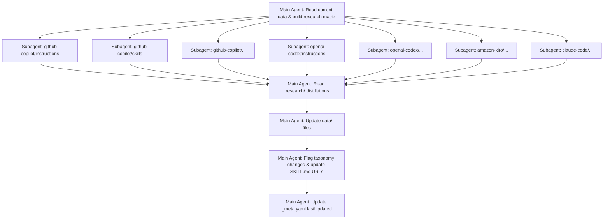

# Revise SKILL.md for Subagent-Based Research

## Problem Statement

The current SKILL.md instructs the agent to fetch 50+ URLs and perform web searches for 4 vendors in a single pass, which exhausts the context window. We need to restructure it into a fan-out/gather/synthesize pattern using subagents.

## Requirements

- Spawn one subagent per (vendor, family) pair to research known URLs + web searches
- Each subagent writes a compact distilled markdown file to a gitignored scratch directory
- Main agent waits for all research to complete before reading distillations and updating `data/` files
- Main agent also flags if the family taxonomy in `_meta.yaml` needs revision (deprecations, new cross-vendor patterns)
- SKILL.md should be self-updating (new URLs discovered get added)

## Background

- There are 4 vendors × 8 families = up to 32 (vendor, family) pairs, though not all combos exist (~36 extensions currently, some families doubled per vendor)
- Kiro's `subagent` tool supports DAG-based stage orchestration with `depends_on` for fan-out/fan-in patterns
- Each stage needs a `role` referencing an agent config in `.kiro/agents/`
- Subagents can read/write files and use web tools, then report back via `summary`
- A gitignored `.research/` directory will hold the distilled findings

## Proposed Solution

Three-phase approach orchestrated by the SKILL.md instructions:

1. **Phase 1 — Fan-out research**: Main agent uses the `subagent` tool to spawn parallel research stages, one per (vendor, family) pair. Each subagent fetches relevant known URLs, performs targeted web searches, and writes a distilled markdown file to `.research/<vendor>/<family>.md`.

2. **Phase 2 — Gather & synthesize**: Main agent reads all `.research/**/*.md` files, compares findings against current `data/` files, and applies updates.

3. **Phase 3 — Meta-review & self-update**: Main agent flags taxonomy changes needed in `_meta.yaml`, updates the SKILL.md known URLs section, and updates `lastUpdated`.

## Task Breakdown

### Task 1: Add `.research/` to `.gitignore`

- **Objective**: Ensure the scratch research directory is gitignored
- **Guidance**: Append `.research/` to the existing `.gitignore`
- **Demo**: `git status` shows `.research/` is ignored

### Task 2: Create the research subagent configuration

Create `.kiro/agents/vendor-researcher.json`.

- **Objective**: Define a lightweight agent config for the research subagents
- **Guidance**: The agent needs `web_search`, `web_fetch`, `read` (to read current data files), and `write` (to write distillation files) tools. Give it a focused system prompt: "You are a research agent. Your job is to fetch documentation URLs, perform web searches, and write a concise distilled summary of your findings to a specified file path. Focus only on facts relevant to the Agent-Ex data schema." Keep it minimal — no hooks, no MCP, no resources.
- **Demo**: `kiro-cli agent validate .kiro/agents/vendor-researcher.json` passes

### Task 3: Rewrite SKILL.md — Phase 1 (research fan-out)

- **Objective**: Replace the current monolithic update procedure with instructions for the main agent to build a (vendor, family) research matrix and spawn subagents
- **Guidance**: The SKILL.md should instruct the main agent to:
  1. Read all `data/*.md` files to build the matrix of (vendor, family) pairs with their current extensions, source URLs, and vendor terms
  2. Read the "Known source URLs" and "Vendor documentation domains" sections from SKILL.md itself
  3. For each (vendor, family) pair, construct a subagent stage with a `prompt_template` that includes: the vendor ID, family ID, relevant known URLs for that family's extensions, the vendor's doc domain for web searches, the current extension data for comparison, and the output file path `.research/<vendor-id>/<family-id>.md`
  4. Use the `subagent` tool with all research stages running in parallel (no `depends_on` between them), in `blocking` mode
  5. Include the distillation template in the prompt so each subagent writes a consistent format

### Task 4: Rewrite SKILL.md — Phase 2 (gather & synthesize)

- **Objective**: Add instructions for the main agent to read all distillation files and update `data/` vendor files

### Task 5: Rewrite SKILL.md — Phase 3 (meta-review & self-update)

- **Objective**: Add instructions for taxonomy flagging, SKILL.md self-update, and lastUpdated bump

### Task 6: Trim inline reference data from SKILL.md

- **Objective**: Reduce the SKILL.md's own token footprint by removing data that's already in `_meta.yaml` or can be derived from the data files
- **Guidance**: Remove the inline "Normalized families" and "Scopes" lists from SKILL.md — instead instruct the agent to read `data/_meta.yaml` for these. Keep the data schema (it's the contract), vendor domains (needed for search queries), and known URLs (the self-updating registry).
